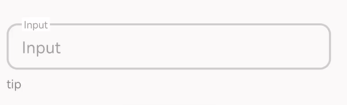
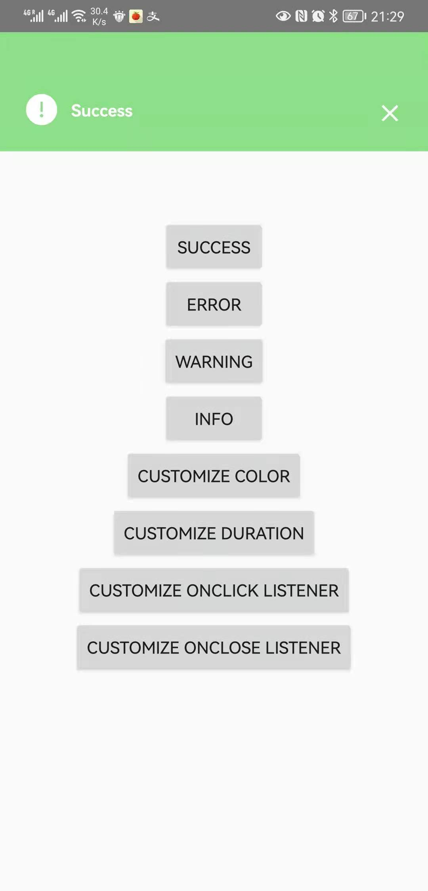

# UIKit

[](https://jitpack.io/#yuyi2583/UIKit)

[中文](./README.md) | **English**

Android UI Library

## preview

### [OutlineEditText](./usage/OutlineEditText-en.md)



### [Popup](./usage/Popup-en.md)



## Add the dependency

```css
allprojects {
		repositories {
			...
			maven { url 'https://jitpack.io' }
		}
	}
```

```css
dependencies {
	   implementation 'com.github.yuyi2583:UIKit:1.0.3'
}
```