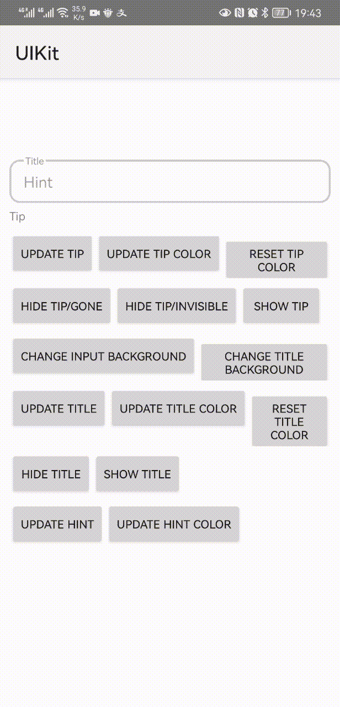

**中文** | [English](./OutlineEditText-en.md)

# 说明

这是一个带标题和底部提示的输入框控件，可以自由设置各部分的background



# 使用方法

```xml
<com.yuyi.uikit.outlineedittext.OutlineEditText
        android:layout_width="match_parent"
        android:layout_height="wrap_content"
        android:id="@+id/oet_input"
        android:layout_marginHorizontal="@dimen/dp10"
        app:title="Title"
        app:hint="Hint"
        app:tip="Tip"
        app:inputBackground="@null"
        android:layout_marginTop="@dimen/dp80"
        android:layout_marginBottom="@dimen/dp8"/>
```

# 属性

| 属性              | 说明             | 类型             | 默认值       | 枚举                                    |
| ----------------- | ---------------- | ---------------- | ------------ | --------------------------------------- |
| title             | 边框标题         | string           | title        | -                                       |
| titleVisibility   | 边框标题可见性   | enum             | View.VISIBLE | View.VISIBLE, View.GONE, View.INBISIBLE |
| titleTextColor    | 标题字体颜色     | color            | #999999      | -                                       |
| titleBackground   | 标题背景         | reference，color | #FFFFFFFF    | -                                       |
| hint              | 输入框占位符     | string           | placeholder  | -                                       |
| tip               | 底部提示         | string           | -            | -                                       |
| tipVisibility     | 底部提示可见性   | enum             | View.GONE    | View.VISIBLE, View.GONE, View.INBISIBLE |
| tipTextColor      | 底部提示字体颜色 | color            | #888888      | -                                       |
| inputBackground   | 输入框背景       | reference，color | -            | -                                       |
| android:inputType | 输入类型         | enum             | -            | -                                       |

# API

| 方法               | 说明                                                         | 返回类型 | 参数类型 | 枚举                                    |
| ------------------ | ------------------------------------------------------------ | -------- | -------- | --------------------------------------- |
| setTitleBackground | 设置标题背景                                                 | void     | Drawable | View.VISIBLE, View.GONE, View.INBISIBLE |
| setInputBackground | 设置输入框背景，若参数为空，则设置为默认背景/layout标注背景  | void     | Drawable | -                                       |
| setInputBackground | 设置默认输入框背景                                           | void     | -        | -                                       |
| setTitleVisibility | 设置边框标题可见性                                           | void     | int      | -                                       |
| setInputType       | 设置输入框类型                                               | void     | int      | -                                       |
| setTipVisibility   | 设置底部提示可见性                                           | void     | int      | View.VISIBLE, View.GONE, View.INBISIBLE |
| setTip             | 设置底部提示文字，若参数不为空及空字符串，tip的可见性将会被设置为VISIBILE | void     | String   | -                                       |
| setTipColor        | 设置底部提示文字颜色                                         | void     | int      | -                                       |
| setTipColor        | 设置底部提示文字颜色为默认颜色/layout标注颜色                | void     | -        | -                                       |
| setTitleColor      | 设置边框标题颜色                                             | void     | int      | -                                       |
| setTitleColor      | 设置边框标题颜色为默认颜色/layout标注颜色                    | void     | -        | -                                       |
| setTitle           | 设置边框标题文字                                             | void     | String   | -                                       |
| setHint            | 设置输入框占位符文字                                         | void     | String   | -                                       |
| getText            | 获取用户输入的文字                                           | String   | -        | -                                       |
| setHintColor       | 设置输入框占位符颜色                                         | void     | int      | -                                       |

