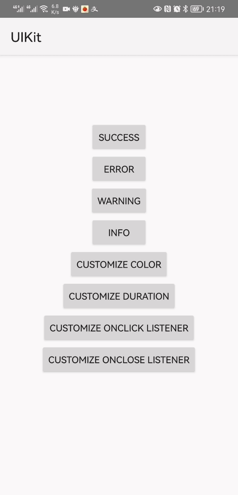

**中文** | [English](./Popup-en.md)

# 说明

这是一个顶部弹框，分为*success*, *info*, *error*, *warning*四种类型，支持自定义颜色，持续时间，点击事件和关闭事件。



# 用法

```java
Popup.top(this, "Success").success();
Popup.top(this, "Error").error();
Popup.top(this, "Warning").warning();
Popup.top(this, "Info").info();
//自定义颜色
Popup.top(this, "Customize Color").show(getColor(R.color.gray));
//设置持续时间
Popup.top(this, "duration is 40000 millis")
                .duration(4000)
                .success();
//设置点击事件
Popup.top(this,"set on click event")
                .onClick(()-> Toast.makeText(this,"onclick event",Toast.LENGTH_SHORT).show())
                .success();
//设置关闭事件
Popup.top(this,"set on close event")
                .onClose(()->Toast.makeText(this,"onclose event",Toast.LENGTH_SHORT).show())
                .info();
```

